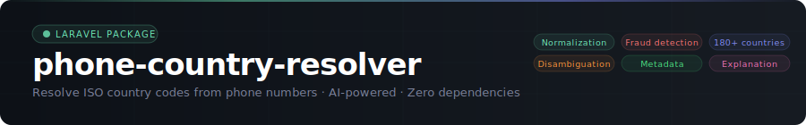
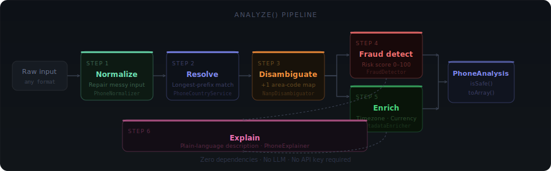

<div align="center">



<br/>

[](https://packagist.org/packages/wal3fo/phone-country)
[](https://packagist.org/packages/wal3fo/phone-country)
[](https://php.net)
[](https://laravel.com)
[](LICENSE)

<br/>

**Resolve ISO 3166-1 alpha-2 country codes from phone numbers.**  
AI-powered normalization · NANP disambiguation · Fraud detection · Rich metadata · Zero dependencies.

<br/>

```bash
composer require wal3fo/phone-country
```

</div>

---

## How it works

`analyze()` runs six AI stages in sequence, building on the existing `resolve()` pipeline:

<div align="center">

</div>

<br/>

---

## ✦ What's new in v2.0

| Feature | Method | Description |
|---|---|---|
| 🧹 Smart normalization | `analyze()` | Repairs messy inputs — strips labels, removes `(0)` trunk prefixes, collapses separators |
| 🌎 NANP disambiguation | `analyze()` | Resolves `+1` to the correct country using a full area-code map for 25+ territories |
| 🔍 Fraud detection | `analyze()` | Classifies number type and scores risk 0–100 using prefix tables and structural signals |
| 🌐 Rich metadata | `analyze()` | Timezone, currency, language, subscriber length for 180+ countries |
| 💬 Explanation | `analyze()` | Plain-language description — deterministic, no LLM, no API key |
| 📦 Batch | `analyzeMany()` | Processes arrays in a single call |

> All v1.x methods — `resolve()`, `resolveMany()`, `normalize()`, `resolveCountryCode()` — are fully unchanged.

---

## Quick start

```php
use Wal3fo\PhoneCountry\PhoneCountryService;

$analysis = PhoneCountryService::analyze('+18765551234');

// ── Disambiguation ──────────────────────────────────────
$analysis->disambiguatedCountryCode;   // 'JM'  ← Jamaica, not US
$analysis->disambiguationNote;         // 'Area code 876 is assigned to JM, not US.'
$analysis->countryCode();              // 'JM'  ← disambiguation-aware

// ── Fraud & Risk ────────────────────────────────────────
$analysis->riskLevel;                  // 'low'
$analysis->riskScore;                  // 0–100
$analysis->numberType;                 // 'mobile'
$analysis->fraudSignals;               // []

// ── Rich Metadata ────────────────────────────────────────
$analysis->timezone;                   // 'America/Jamaica'
$analysis->currency;                   // 'JMD'
$analysis->language;                   // 'en'
$analysis->subscriberLength;           // 7
$analysis->lengthValid;                // true

// ── Explanation ──────────────────────────────────────────
$analysis->explanation;
// "This appears to be a mobile number from Jamaica (dial code +1).
//  Area code 876 is assigned to JM, not US.
//  The standardized E.164 format is +18765551234.
//  No fraud signals were detected."

// ── Safety ───────────────────────────────────────────────
$analysis->isSafe();   // true  (low risk + valid length + resolved)
$analysis->toArray();  // full array for API responses
```

---

## AI features

### 🧹 Smart normalization

Messy real-world inputs are cleaned before resolution:

```php
// Parentheses, dots, dashes
PhoneCountryService::analyze('(+212) 06-12.345.678')->normalizedInput;    // '+212612345678'
PhoneCountryService::analyze('(+212) 06-12.345.678')->wasNormalized;      // true

// UK-style trunk prefix
PhoneCountryService::analyze('+44 (0)20 7946 0958')->result->countryCode; // 'GB'

// Label prefix from contact books
PhoneCountryService::analyze('Phone: +33612345678')->result->countryCode;  // 'FR'
```

---

### 🌎 NANP disambiguation

`+1` is shared by 25+ countries. `analyze()` uses the 3-digit area code to resolve the correct one:

```php
PhoneCountryService::analyze('+18765551234')->disambiguatedCountryCode; // 'JM' — Jamaica
PhoneCountryService::analyze('+14165551234')->disambiguatedCountryCode; // 'CA' — Canada
PhoneCountryService::analyze('+12425551234')->disambiguatedCountryCode; // 'BS' — Bahamas
PhoneCountryService::analyze('+17875551234')->disambiguatedCountryCode; // 'PR' — Puerto Rico
PhoneCountryService::analyze('+18695551234')->disambiguatedCountryCode; // 'KN' — Saint Kitts
PhoneCountryService::analyze('+12125551234')->disambiguatedCountryCode; // 'US' — no overhead
```

Covers all assigned NANP area codes: `US` · `CA` · `JM` · `BS` · `BB` · `AG` · `AI` · `VI` · `KY` · `BM` · `GD` · `TC` · `MS` · `GU` · `MP` · `AS` · `SX` · `LC` · `DM` · `PR` · `VC` · `DO` · `TT` · `KN` · `VG`

---

### 🔍 Fraud signal detection

```php
// Toll-free number
$a = PhoneCountryService::analyze('+18005551234');
$a->numberType;    // 'toll_free'
$a->riskLevel;     // 'medium'
$a->riskScore;     // 30
$a->fraudSignals;  // ['toll_free_range']

// Premium-rate number
$b = PhoneCountryService::analyze('+19005551234');
$b->numberType;    // 'premium'
$b->riskLevel;     // 'high'
$b->riskScore;     // 50

// Repeating digits — fake/test number
$c = PhoneCountryService::analyze('+212611111111');
$c->fraudSignals;  // ['repeating_digit_pattern']
$c->riskLevel;     // 'high'
```

**Risk levels:** `low` (0–29) · `medium` (30–59) · `high` (60–100)

**Detected signals:** `toll_free_range` · `premium_rate_range` · `voip_pattern` · `repeating_digit_pattern` · `sequential_digit_pattern` · `fictional_reserved_range` · `unresolvable_country`

**Number types:** `mobile` · `landline` · `voip` · `toll_free` · `premium` · `unknown`

---

### 🌐 Rich metadata enrichment

```php
$a = PhoneCountryService::analyze('+212612345678');
$a->timezone;           // 'Africa/Casablanca'
$a->currency;           // 'MAD'
$a->language;           // 'ar'
$a->subscriberLength;   // 9
$a->lengthValid;        // true

$b = PhoneCountryService::analyze('+33612345678');
$b->timezone;           // 'Europe/Paris'
$b->currency;           // 'EUR'
$b->language;           // 'fr'
```

Covers 180+ countries with IANA timezone · ISO 4217 currency · BCP 47 language · expected subscriber length.

---

### 📦 Batch analysis

```php
$results = PhoneCountryService::analyzeMany([
    '+212612345678',
    '+18765551234',
    '(+44) (0)20 7946 0958',
]);

foreach ($results as $analysis) {
    echo $analysis->countryCode() . ': ' . $analysis->riskLevel . PHP_EOL;
}
// MA: low
// JM: low
// GB: low
```

---

## Core methods — v1.x

### `resolve()`

```php
$result = PhoneCountryService::resolve('+212612345678');

$result->countryCode;  // 'MA'
$result->countryName;  // 'Morocco'
$result->dialCode;     // '+212'
$result->isResolved;   // true
$result->format;       // 'international'
$result->e164;         // '+212612345678'
$result->isValid();    // true
$result->toArray();    // ready for API responses
echo $result;          // 'MA'
```

With a local number fallback:

```php
$result = PhoneCountryService::resolve('0612345678', 'MA');
$result->countryCode;  // 'MA'
$result->format;       // 'local'
$result->e164;         // '+212612345678'
```

### `resolveMany()`

```php
$results = PhoneCountryService::resolveMany([
    '+212612345678',
    '+33612345678',
    '0612345678',
], 'MA'); // returns PhoneResult[] in the same order
```

### `normalize()`

```php
PhoneCountryService::normalize('+212612345678');      // '+212612345678'
PhoneCountryService::normalize('00212612345678');     // '+212612345678'
PhoneCountryService::normalize('0612345678', 'MA');   // '+212612345678'
PhoneCountryService::normalize('0612345678');         // null — unresolvable
```

### Validation rule

```php
use Wal3fo\PhoneCountry\Rules\PhoneCountryRule;

// Any valid international number
'phone' => ['required', new PhoneCountryRule()]

// With Morocco as local fallback
'phone' => ['required', new PhoneCountryRule('MA')]

// Restrict to a country allowlist
'phone' => ['required', new PhoneCountryRule(['MA', 'FR', 'ES'])]

// Strict mode — reject local 0xxx format
'phone' => ['required', new PhoneCountryRule('MA', strict: true)]
```

Example in a Form Request:

```php
use Wal3fo\PhoneCountry\Rules\PhoneCountryRule;

class RegisterRequest extends FormRequest
{
    public function rules(): array
    {
        return [
            'name'  => ['required', 'string'],
            'phone' => ['required', 'string', new PhoneCountryRule('MA')],
        ];
    }
}
```

### `resolveCountryCode()` — backward compatible

```php
PhoneCountryService::resolveCountryCode('+212612345678');       // 'MA'
PhoneCountryService::resolveCountryCode('0612345678', 'MA');   // 'MA'
PhoneCountryService::resolveCountryCode('0612345678');         // 'XX'
```

### Dependency injection

```php
class UserProfileController extends Controller
{
    public function __construct(
        protected PhoneCountryService $phoneService
    ) {}

    public function update(Request $request)
    {
        $result = $this->phoneService->resolve($request->phone_number);

        $user->update([
            'phone'        => $result->e164,
            'country_code' => $result->countryCode,
        ]);
    }
}
```

---

## `PhoneAnalysis` reference

| Property | Type | Description |
|---|---|---|
| `result` | `PhoneResult` | Underlying result from `resolve()` |
| `rawInput` | `string` | Original input before normalization |
| `normalizedInput` | `string` | Cleaned input passed to resolver |
| `wasNormalized` | `bool` | Whether the input required repair |
| `disambiguatedCountryCode` | `string` | Best country code — NANP area-code aware |
| `disambiguationNote` | `?string` | Human note if `+1` was disambiguated |
| `riskLevel` | `string` | `low` / `medium` / `high` |
| `riskScore` | `int` | 0–100 |
| `numberType` | `string` | `mobile` / `landline` / `voip` / `toll_free` / `premium` / `unknown` |
| `fraudSignals` | `string[]` | Detected signal labels |
| `timezone` | `?string` | IANA timezone identifier |
| `currency` | `?string` | ISO 4217 currency code |
| `language` | `?string` | BCP 47 language tag |
| `subscriberLength` | `?int` | Expected digits after dial code |
| `lengthValid` | `bool` | Whether number length is plausible |
| `explanation` | `string` | Plain-language description |

**Methods:** `countryCode()` — disambiguation-aware best code · `isSafe()` — low risk + valid length + resolved · `toArray()` — full array for API responses

---

## Examples

| Input | Country | Name | Format |
|---|---|---|---|
| `+212612345678` | `MA` | Morocco | international |
| `00212612345678` | `MA` | Morocco | international |
| `0612345678` + `'MA'` | `MA` | Morocco | local |
| `+1 876 555 1234` | `JM` | Jamaica | international |
| `+1 416 555 1234` | `CA` | Canada | international |
| `+33612345678` | `FR` | France | international |
| `+1 242 123 4567` | `BS` | Bahamas | international |
| `0612345678` | `XX` | Unknown | local |

---

## Installation & configuration

```bash
composer require wal3fo/phone-country

# Optionally publish the config
php artisan vendor:publish --tag=phone-country-config
```

```php
// config/phone-country.php
return [
    'default_country' => env('PHONE_COUNTRY_DEFAULT', 'XX'),
    'unknown_code'    => 'XX',
];
```

```env
PHONE_COUNTRY_DEFAULT=MA
```

**Performance** — for high-volume workloads, cache `analyze()` results:

```php
$analysis = Cache::remember("phone_analysis:{$phone}", 3600, fn () =>
    PhoneCountryService::analyze($phone)
);
```

---

## File structure

```
src/
├── PhoneCountryService.php          ← Main service — all public methods
├── PhoneCountryServiceProvider.php
├── PhoneResult.php                  ← Value object from resolve()
├── PhoneAnalysis.php                ← Value object from analyze()  ✦ new
├── Rules/
│   └── PhoneCountryRule.php         ← Laravel validation rule
└── AI/                              ✦ new
    ├── PhoneNormalizer.php          ← Smart input normalization
    ├── NanpDisambiguator.php        ← +1 area-code map (25+ countries)
    ├── FraudDetector.php            ← Risk scoring & type classification
    ├── MetadataEnricher.php         ← Timezone / currency / language / length
    └── PhoneExplainer.php           ← Plain-language explanation generator
config/
└── phone-country.php
```

---

## Changelog

### v2.0.0
- Added `analyze()` returning `PhoneAnalysis` with all AI features in one call
- Added `analyzeMany()` for batch analysis
- Added `AI/PhoneNormalizer` — smart input normalization
- Added `AI/NanpDisambiguator` — full NANP area-code map, 25+ countries
- Added `AI/FraudDetector` — risk scoring, type classification, signal detection
- Added `AI/MetadataEnricher` — timezone / currency / language / length for 180+ countries
- Added `AI/PhoneExplainer` — plain-language explanation generator
- Added `PhoneAnalysis` value object

### v1.0.2
- Added `PhoneResult` value object from `resolve()`
- Added `resolveMany()`, `normalize()`, publishable config
- Added `PhoneCountryRule` — validation rule with allowlist and strict mode

### v1.0.1
- Initial release with `resolveCountryCode()` and longest-prefix matching

---

## Contributing

1. Fork the repository
2. Create a feature branch: `git checkout -b feature/your-feature`
3. Commit your changes: `git commit -m 'Add your feature'`
4. Push to the branch: `git push origin feature/your-feature`
5. Open a Pull Request

---

## License

The MIT License (MIT). See [LICENSE](LICENSE) for full details.
